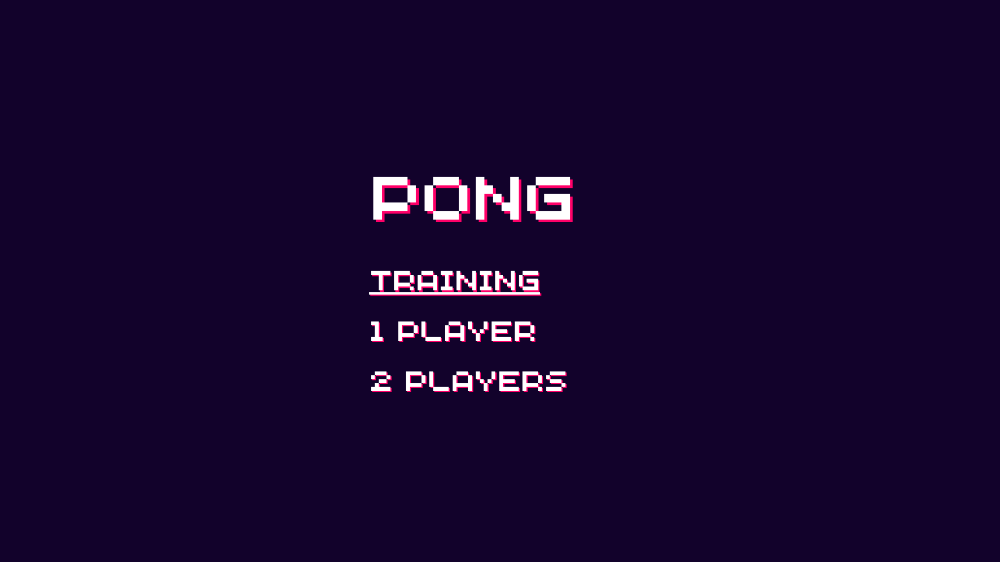

# pygames
Collection of games built with Python.

You can run them on Linux, Mac, and Windows, as long as Python is installed on your machine.


## Games

### 1. [Pong](./01-boing) - Work In Progress



This first game is a Pong clone. I am finishing at the moment the training part. It allows the player to play alone, without an IA or another player.

I'll then add the the mode player versus player before implementing the IA.


## Prerequisites (if you want to use it on your computer)

- Python (version 3.9 and more should work fine).
- Virtualenv.


## How to install

### On Mac (and probably Linux)

Once the repo has been cloned on your computer, cd into on the game, e.g. `cd 01-boing`.


- Setting up venv

```
$ python3 -m venv .venv
```


- Launching the virtual environment

```
$ source .venv/bin/activate
```


- Installing the dependencies

```
$ pip install -r requirements.txt
```


To exit the virtual env (once you finish playing with the games).

```
deactivate
```


### On Windows

**Please, be cafeful**: I haven't been able to add venv with Windows.
So we'll have to install everything globaly.

Once the repo has been cloned on your computer, cd into on the game, e.g. `cd 01-boing`.

- Installing the dependencies

```
$ pip install -r requirements.txt
```


## How to play?

- All the games are located into specific folders. For example, the Pong clone is located in the `01-boing` folder.
- Open a terminal and cd into it, e.g. `cd 01-boing`.
- Then launch the game by calling the app file with python, e.g. `python app.py`.
- To exit the game, close the game window.
